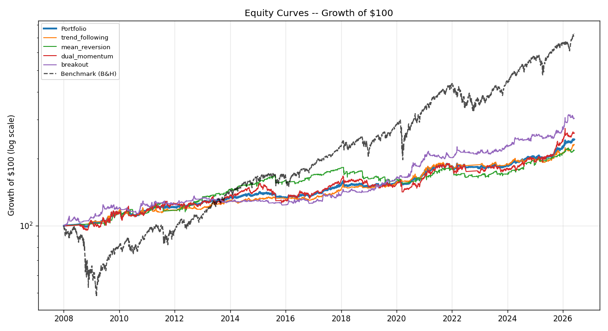
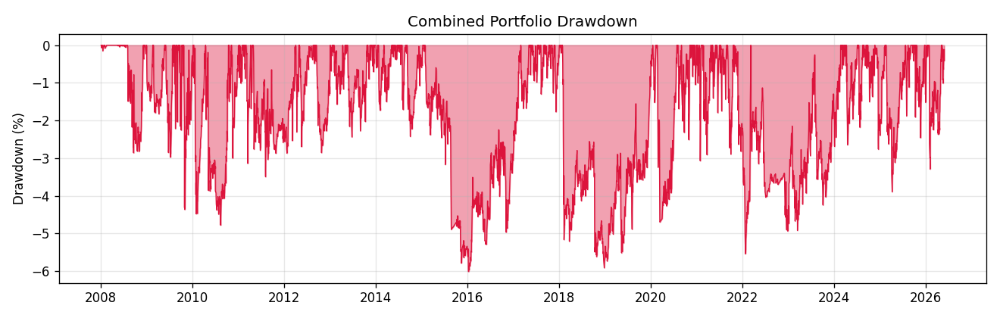
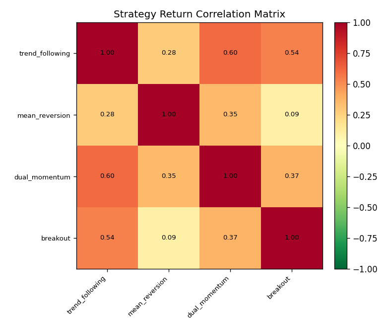
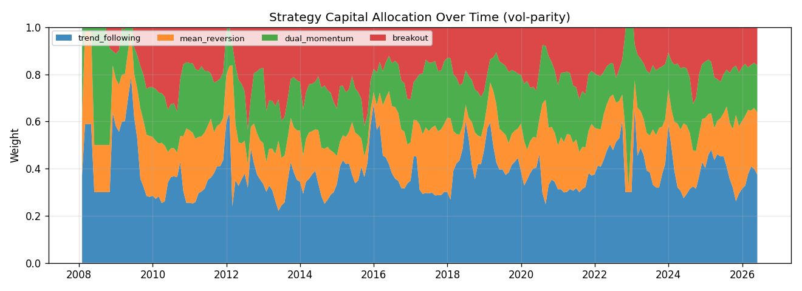

# Multi-Strategy Long-Only Trading System -- Backtest Report

*Generated: 2026-05-29 11:49 UTC*

> **Mandate:** long-only, leverage-free, every position risk-managed with a stop-loss and (where applicable) a take-profit and/or trailing stop. Capital is split across deliberately uncorrelated strategy sleeves.

## 1. Run Parameters

| Parameter | Value |
|---|---|
| Period | 2008-01-02 to 2026-05-28 |
| Initial Capital | $1,000,000 |
| Risk-Free Rate | 2.00% |
| Commission | 1.0 bps/side |
| Slippage | 5.0 bps/side |
| Vol-Parity Overlay | True |
| Strategies | trend_following, mean_reversion, dual_momentum, breakout |
| Benchmark | SPY |
| Synthetic Data Used | none |

## 2. Combined Portfolio Performance

| Metric | Value |
|---|---|
| Initial Equity | $1,000,000 |
| Final Equity | $2,441,122 |
| Total Return | 144.11% |
| CAGR | 4.98% |
| Annualised Volatility | 5.25% |
| Sharpe Ratio | 0.57 |
| Sortino Ratio | 0.53 |
| Calmar Ratio | 0.83 |
| Max Drawdown | -6.01% |
| Avg Drawdown | -2.14% |
| Max DD Duration (days) | 525 |
| Daily VaR (95%) | -0.49% |
| Daily CVaR (95%) | -0.84% |
| Return Skew | -0.70 |
| Return Kurtosis | 5.93 |
| Best Day | 2.01% |
| Worst Day | -2.39% |
| Time in Market | 99.48% |
| Beta vs Benchmark | 0.10 |
| Annualised Alpha | 1.91% |
| Correlation vs Benchmark | 38.10% |
| Number of Trades | 1,781 |
| Win Rate | 55.25% |
| Profit Factor | 1.54 |
| Payoff Ratio (avg win/loss) | 1.25 |
| Expectancy / Trade | $2,402 |
| Avg Winning Trade | $12,350 |
| Avg Losing Trade | $-9,880 |
| Avg Trade Return | 0.77% |
| Best Trade | 77.22% |
| Worst Trade | -22.61% |
| Avg Holding (days) | 17.0 |

### 2.1 Portfolio vs Buy & Hold Benchmark

| Metric | portfolio | SPY (B&H) |
|---|---|---|
| CAGR | 4.98% | 11.42% |
| Annualised Volatility | 5.25% | 19.83% |
| Sharpe Ratio | 0.57 | 0.54 |
| Sortino Ratio | 0.53 | 0.52 |
| Calmar Ratio | 0.83 | 0.22 |
| Max Drawdown | -6.01% | -51.87% |
| Win Rate | 55.25% | - |
| Profit Factor | 1.54 | - |
| Number of Trades | 1,781 | - |
| Time in Market | 99.48% | 99.72% |

## 3. Diversification -- Strategy Correlation Matrix

The core thesis is that these sleeves make money at different times. Low pairwise correlation is what lets the blended Sharpe exceed the individual sleeves'.

| | trend_following | mean_reversion | dual_momentum | breakout |
|---|---|---|---|---|
| **trend_following** | 1.00 | 0.28 | 0.60 | 0.54 |
| **mean_reversion** | 0.28 | 1.00 | 0.35 | 0.09 |
| **dual_momentum** | 0.60 | 0.35 | 1.00 | 0.37 |
| **breakout** | 0.54 | 0.09 | 0.37 | 1.00 |

**Average pairwise correlation: 0.37** (lower is better for diversification).

## 4. Strategy Sleeves -- Side by Side

| Metric | trend_following | mean_reversion | dual_momentum | breakout |
|---|---|---|---|---|
| CAGR | 4.68% | 4.33% | 5.36% | 6.24% |
| Annualised Volatility | 5.72% | 7.05% | 9.52% | 7.07% |
| Sharpe Ratio | 0.48 | 0.35 | 0.39 | 0.61 |
| Sortino Ratio | 0.50 | 0.44 | 0.36 | 0.67 |
| Calmar Ratio | 0.70 | 0.25 | 0.29 | 0.69 |
| Max Drawdown | -6.69% | -17.68% | -18.26% | -9.07% |
| Win Rate | 45.27% | 66.25% | 54.39% | 41.29% |
| Profit Factor | 1.72 | 1.22 | 1.85 | 1.59 |
| Number of Trades | 296 | 889 | 114 | 482 |
| Time in Market | 77.65% | 31.62% | 98.44% | 74.21% |

## 5. Strategy Sleeve Detail

### 5.1 trend_following

| Metric | Value |
|---|---|
| Initial Equity | $1,000,079 |
| Final Equity | $2,317,224 |
| Total Return | 131.70% |
| CAGR | 4.68% |
| Annualised Volatility | 5.72% |
| Sharpe Ratio | 0.48 |
| Sortino Ratio | 0.50 |
| Calmar Ratio | 0.70 |
| Max Drawdown | -6.69% |
| Avg Drawdown | -2.17% |
| Max DD Duration (days) | 475 |
| Daily VaR (95%) | -0.53% |
| Daily CVaR (95%) | -0.94% |
| Return Skew | -0.66 |
| Return Kurtosis | 6.81 |
| Best Day | 2.06% |
| Worst Day | -2.44% |
| Time in Market | 77.65% |
| Beta vs Benchmark | 0.09 |
| Annualised Alpha | 1.78% |
| Correlation vs Benchmark | 30.67% |
| Number of Trades | 296 |
| Win Rate | 45.27% |
| Profit Factor | 1.72 |
| Payoff Ratio (avg win/loss) | 2.08 |
| Expectancy / Trade | $2,956 |
| Avg Winning Trade | $15,539 |
| Avg Losing Trade | $-7,453 |
| Avg Trade Return | 1.25% |
| Best Trade | 31.28% |
| Worst Trade | -8.19% |
| Avg Holding (days) | 37.0 |

**Exit reason breakdown:**

| Exit Reason | Trades | Win Rate | Total P&L |
|---|---|---|---|
| signal | 1 | 100.0% | $4,372 |
| stop | 295 | 45.1% | $870,480 |

### 5.2 mean_reversion

| Metric | Value |
|---|---|
| Initial Equity | $1,000,079 |
| Final Equity | $2,180,321 |
| Total Return | 118.01% |
| CAGR | 4.33% |
| Annualised Volatility | 7.05% |
| Sharpe Ratio | 0.35 |
| Sortino Ratio | 0.44 |
| Calmar Ratio | 0.25 |
| Max Drawdown | -17.68% |
| Avg Drawdown | -5.11% |
| Max DD Duration (days) | 959 |
| Daily VaR (95%) | -0.50% |
| Daily CVaR (95%) | -1.14% |
| Return Skew | -0.65 |
| Return Kurtosis | 26.80 |
| Best Day | 5.60% |
| Worst Day | -5.04% |
| Time in Market | 31.62% |
| Beta vs Benchmark | 0.13 |
| Annualised Alpha | 1.09% |
| Correlation vs Benchmark | 36.52% |
| Number of Trades | 889 |
| Win Rate | 66.25% |
| Profit Factor | 1.22 |
| Payoff Ratio (avg win/loss) | 0.62 |
| Expectancy / Trade | $630 |
| Avg Winning Trade | $5,240 |
| Avg Losing Trade | $-8,422 |
| Avg Trade Return | 0.21% |
| Best Trade | 9.95% |
| Worst Trade | -11.11% |
| Avg Holding (days) | 3.6 |

**Exit reason breakdown:**

| Exit Reason | Trades | Win Rate | Total P&L |
|---|---|---|---|
| signal | 829 | 70.9% | $2,045,690 |
| stop | 35 | 0.0% | $-1,138,719 |
| target | 1 | 100.0% | $37,337 |
| time | 24 | 0.0% | $-384,681 |

### 5.3 dual_momentum

| Metric | Value |
|---|---|
| Initial Equity | $1,000,079 |
| Final Equity | $2,610,693 |
| Total Return | 161.05% |
| CAGR | 5.36% |
| Annualised Volatility | 9.52% |
| Sharpe Ratio | 0.39 |
| Sortino Ratio | 0.36 |
| Calmar Ratio | 0.29 |
| Max Drawdown | -18.26% |
| Avg Drawdown | -5.29% |
| Max DD Duration (days) | 741 |
| Daily VaR (95%) | -0.93% |
| Daily CVaR (95%) | -1.49% |
| Return Skew | -1.18 |
| Return Kurtosis | 11.51 |
| Best Day | 3.25% |
| Worst Day | -7.28% |
| Time in Market | 98.44% |
| Beta vs Benchmark | 0.14 |
| Annualised Alpha | 2.12% |
| Correlation vs Benchmark | 30.06% |
| Number of Trades | 114 |
| Win Rate | 54.39% |
| Profit Factor | 1.85 |
| Payoff Ratio (avg win/loss) | 1.55 |
| Expectancy / Trade | $11,320 |
| Avg Winning Trade | $45,328 |
| Avg Losing Trade | $-29,227 |
| Avg Trade Return | 2.30% |
| Best Trade | 77.22% |
| Worst Trade | -16.10% |
| Avg Holding (days) | 72.7 |

**Exit reason breakdown:**

| Exit Reason | Trades | Win Rate | Total P&L |
|---|---|---|---|
| signal | 89 | 64.0% | $1,334,663 |
| stop | 25 | 20.0% | $-44,128 |

### 5.4 breakout

| Metric | Value |
|---|---|
| Initial Equity | $1,000,079 |
| Final Equity | $3,041,767 |
| Total Return | 204.15% |
| CAGR | 6.24% |
| Annualised Volatility | 7.07% |
| Sharpe Ratio | 0.61 |
| Sortino Ratio | 0.67 |
| Calmar Ratio | 0.69 |
| Max Drawdown | -9.07% |
| Avg Drawdown | -3.66% |
| Max DD Duration (days) | 1,167 |
| Daily VaR (95%) | -0.66% |
| Daily CVaR (95%) | -1.12% |
| Return Skew | -0.18 |
| Return Kurtosis | 8.00 |
| Best Day | 3.25% |
| Worst Day | -3.35% |
| Time in Market | 74.21% |
| Beta vs Benchmark | 0.05 |
| Annualised Alpha | 3.72% |
| Correlation vs Benchmark | 15.28% |
| Number of Trades | 482 |
| Win Rate | 41.29% |
| Profit Factor | 1.59 |
| Payoff Ratio (avg win/loss) | 2.27 |
| Expectancy / Trade | $3,223 |
| Avg Winning Trade | $20,973 |
| Avg Losing Trade | $-9,259 |
| Avg Trade Return | 1.13% |
| Best Trade | 43.52% |
| Worst Trade | -22.61% |
| Avg Holding (days) | 16.4 |

**Exit reason breakdown:**

| Exit Reason | Trades | Win Rate | Total P&L |
|---|---|---|---|
| signal | 11 | 54.5% | $50,931 |
| stop | 471 | 41.0% | $1,502,444 |

## 6. Combined Portfolio -- Monthly Returns (%)

| Year | Jan | Feb | Mar | Apr | May | Jun | Jul | Aug | Sep | Oct | Nov | Dec | Year |
|---|---|---|---|---|---|---|---|---|---|---|---|---|---|
| 2008 | 0.4 | 0.1 | 0.2 | 0.2 | 0.2 | 0.2 | 0.2 | -0.5 | -1.6 | -0.3 | 1.9 | 2.9 | 3.8 |
| 2009 | -0.6 | 0.5 | -0.2 | 0.3 | 2.4 | -1.2 | 2.3 | 1.1 | 3.0 | -1.4 | 2.8 | 0.9 | 10.2 |
| 2010 | -3.3 | 1.4 | 1.8 | 0.8 | -2.4 | 0.1 | -0.9 | 0.5 | 1.0 | 2.2 | 0.1 | 1.9 | 3.0 |
| 2011 | 0.2 | 2.8 | -0.5 | 2.8 | -1.2 | -0.9 | 0.3 | -0.8 | 0.8 | -0.7 | 0.4 | 0.1 | 3.1 |
| 2012 | -0.4 | 1.2 | 1.1 | 0.4 | -1.5 | 1.3 | 0.4 | 0.7 | 0.1 | -0.7 | 0.5 | 1.7 | 4.9 |
| 2013 | 1.2 | -0.7 | 0.4 | 1.0 | -0.2 | -0.2 | 0.7 | -1.2 | 0.8 | 1.5 | 1.1 | 1.2 | 5.8 |
| 2014 | -1.2 | 1.0 | -0.5 | 0.8 | 1.0 | 0.8 | -0.5 | 1.7 | -1.7 | 0.5 | 1.2 | -0.3 | 2.8 |
| 2015 | 1.9 | -0.9 | -0.1 | -0.2 | -0.0 | -0.7 | 0.5 | -3.0 | 0.1 | -0.1 | -0.5 | -0.2 | -3.2 |
| 2016 | 0.0 | 1.4 | 0.1 | -0.5 | -0.9 | 1.5 | 0.9 | -0.7 | 0.8 | -0.8 | -0.4 | 0.9 | 2.6 |
| 2017 | 1.2 | 1.5 | -0.3 | 0.2 | 2.4 | 0.2 | 1.4 | 0.5 | 0.1 | 1.3 | 1.2 | 0.4 | 10.6 |
| 2018 | 3.4 | -3.7 | -0.1 | 0.7 | 0.5 | -0.4 | -0.1 | 1.3 | -0.3 | -2.5 | 0.6 | -0.9 | -1.5 |
| 2019 | 1.0 | 0.0 | 0.9 | 0.7 | -1.9 | 1.5 | -0.1 | 1.6 | -1.1 | 0.2 | 0.5 | 1.6 | 4.9 |
| 2020 | -0.2 | -0.7 | -1.4 | 0.4 | 0.7 | 1.0 | 3.2 | 1.1 | -0.8 | -1.2 | 4.3 | 3.5 | 9.9 |
| 2021 | 0.5 | 2.9 | -0.1 | 2.5 | 0.6 | 1.0 | 0.5 | 0.6 | -2.4 | 2.7 | -1.9 | 0.1 | 7.3 |
| 2022 | -2.8 | 0.9 | 2.5 | -0.3 | 0.2 | -1.7 | 0.1 | 0.2 | -0.0 | 0.0 | 0.2 | -1.2 | -1.9 |
| 2023 | 2.0 | -1.8 | 0.6 | 0.5 | -0.0 | 1.4 | 1.8 | -2.7 | -0.6 | -0.3 | 1.0 | 1.3 | 3.1 |
| 2024 | -0.1 | 2.1 | 1.8 | -1.0 | 0.4 | 1.2 | 0.7 | 1.6 | 1.4 | -0.7 | 1.8 | -2.2 | 7.2 |
| 2025 | 1.6 | -0.8 | 0.2 | -1.0 | 0.9 | 1.2 | -0.0 | 1.4 | 4.6 | 1.8 | -0.1 | 1.3 | 11.5 |
| 2026 | 5.2 | 1.3 | -0.2 | 1.2 | 1.2 |  |  |  |  |  |  |  | 8.9 |

## 7. Methodology & Caveats

- **No look-ahead:** signals are computed on the close of day *t* and filled at the open of day *t+1*. Rolling highs used for breakouts are shifted one bar.
- **Conservative intrabar fills:** if a bar could hit both stop and target, the stop is assumed to fill first; gaps through the stop fill at the open.
- **Costs:** per-side commission and adverse slippage are applied to every fill; idle cash earns the risk-free rate.
- **Leverage-free:** every purchase is gated by available cash, so aggregate exposure can never exceed equity.
- **Survivorship / data:** ETF proxies are used per asset class; adjusted prices fold in dividends and splits. Past performance does not guarantee future results -- size live risk accordingly.
