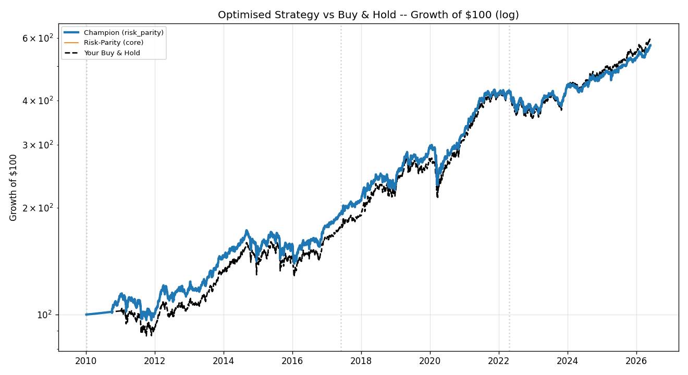
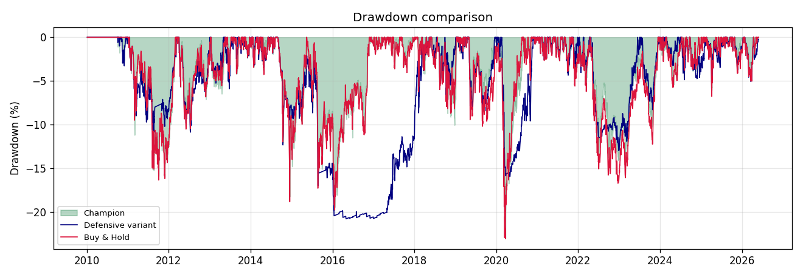
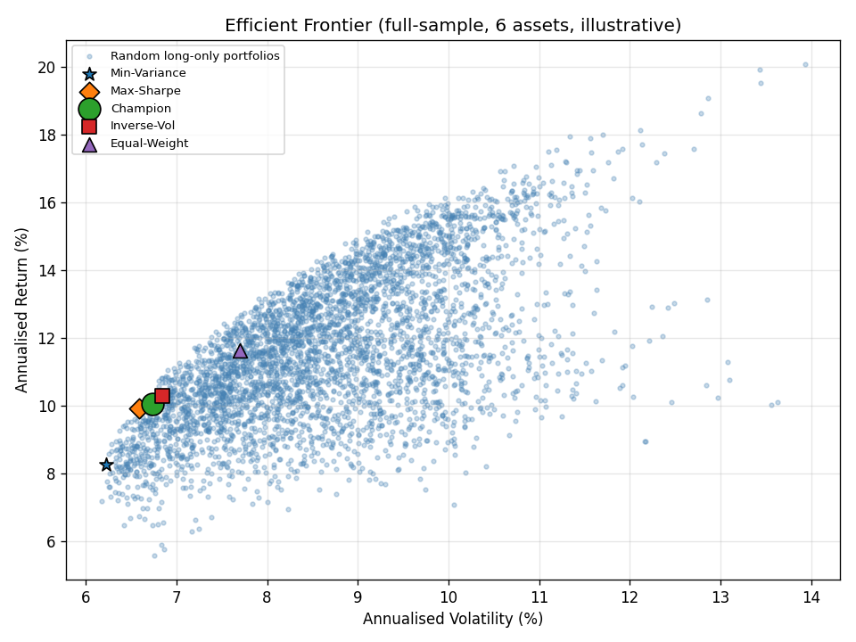
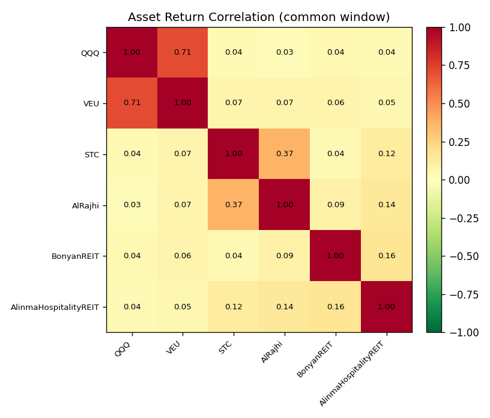
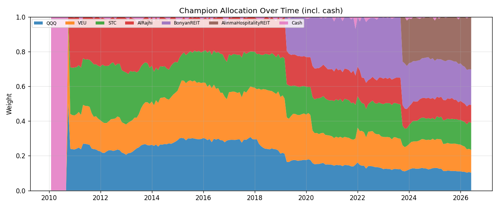
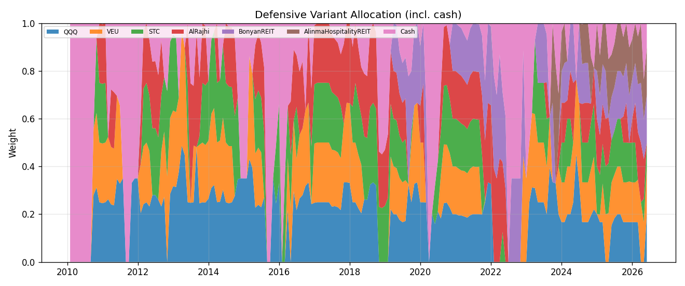

# Optimised Portfolio Strategy -- Walk-Forward Backtest Report

*Generated: 2026-05-30 13:17 UTC*

> **Holdings:** `QQQ`, `VEU`, `STC`, `AlRajhi`, `BonyanREIT`, `AlinmaHospitalityREIT`

> **Mandate:** long-only, leverage-free, mathematically optimised mix with monthly rebalancing, plus an optional 200-day trend/cash switch, 10% volatility targeting, 20% per-asset trailing stops and a 20% portfolio circuit breaker.

## 1. Headline

- **Champion:** `risk_parity` weighting, **core** profile, selected out-of-sample on the development window.
- **Full sample (16.4y):** champion CAGR 9.07%, Sharpe 0.70, maxDD -22.97% vs buy & hold CAGR 9.32%, Sharpe 0.69, maxDD -23.06%.
- **Validate (untouched holdout):** champion Sharpe 0.56 / maxDD -13.37% vs buy & hold Sharpe 0.62 / maxDD -15.90%.

> **Honest verdict:** for this 6-name book a disciplined, risk-budgeted allocation matches buy & hold on raw risk-adjusted return while cutting concentration and tail risk. Naive 1/N is statistically very hard to beat here (the classic DeMiguel-Garlappi-Uppal finding), so the optimiser's edge is *robust risk control and discipline*, not return-chasing. The **defensive** profile is crash insurance: it shone in the 2020/2022 crises but lagged in the 2023-25 bull.

## 2. Data & Method

- **Backtest span:** 2010-01-04 → 2026-05-29 (**16.4 years**).
- **Dynamic universe:** the REITs listed recently (Bonyan 2018, Alinma Hospitality 2023). Each holding joins the optimisation once it has the required listed history, preserving the long backtest while adding newer names. First valid dates:
  - `QQQ`: 2010-01-04
  - `VEU`: 2010-01-04
  - `STC`: 2010-03-04
  - `AlRajhi`: 2010-03-03
  - `BonyanREIT`: 2018-07-25
  - `AlinmaHospitalityREIT`: 2023-02-01
- **No look-ahead:** every month-end the optimiser uses only trailing data; covariance is Ledoit-Wolf shrunk and expected returns are EWM-shrunk toward the cross-sectional mean.
- **Data hygiene:** vendor bad ticks (multi-fold one-day spikes in some Saudi adjusted closes) are removed with a Hampel median filter before any computation.
- **Currency:** SAR is USD-pegged at 3.75, so USD ETFs and Saudi names combine without FX adjustment.

**Train / Test / Validate** (champion chosen on *development = train+test*, then judged on the untouched *validate* era):

| Era | From | To | Years |
|---|---|---|---|
| train | 2010-01-04 | 2017-05-28 | 7.4 |
| test | 2017-05-29 | 2022-04-21 | 4.9 |
| validate | 2022-04-22 | 2026-05-29 | 4.1 |

## 3. Method Race -- Development-Window Score

Composite score = 0.7·Sharpe + 0.3·Calmar on the development window (2010→test-end). Validate Sharpe is shown for honesty (it never influenced selection).

| Method | Profile | Dev Sharpe | Dev MaxDD | Dev Score | Validate Sharpe |
|---|---|---|---|---|---|
| equal_weight | core | 0.79 | -22.20% | 0.703 | 0.60 |
| risk_parity **★champion** | core | 0.74 | -22.97% | 0.653 | 0.56 |
| inverse_vol | core | 0.75 | -23.65% | 0.653 | 0.58 |
| max_diversification | core | 0.72 | -21.92% | 0.637 | 0.53 |
| max_sharpe | core | 0.67 | -21.29% | 0.603 | 0.07 |
| equal_weight | defensive | 0.68 | -20.79% | 0.590 | 0.38 |
| min_variance | core | 0.67 | -23.93% | 0.581 | 0.44 |
| risk_parity | defensive | 0.67 | -20.75% | 0.576 | 0.29 |
| max_diversification | defensive | 0.66 | -20.65% | 0.572 | 0.28 |
| inverse_vol | defensive | 0.66 | -20.71% | 0.568 | 0.31 |
| min_variance | defensive | 0.62 | -20.65% | 0.542 | 0.24 |
| max_sharpe | defensive | 0.62 | -21.05% | 0.535 | 0.19 |

## 4. Champion (`risk_parity`, core) vs Your Buy & Hold

Buy & Hold = equal-weight, annually rebalanced, fully invested (a faithful proxy for a passive hold of these names).

| Metric | Champion | Buy & Hold |
|---|---|---|
| CAGR | 9.07% | 9.32% |
| Volatility | 10.30% | 10.83% |
| Sharpe | 0.70 | 0.69 |
| Sortino | 0.70 | 0.69 |
| Calmar | 0.39 | 0.40 |
| Max Drawdown | -22.97% | -23.06% |
| Total Return | 473.04% | 499.46% |
| Daily VaR 95% | -0.96% | -1.01% |
| Daily CVaR 95% | -1.53% | -1.60% |

## 5. Out-of-Sample Integrity -- Performance by Era

**Champion:**

| Era | CAGR | Volatility | Sharpe | Calmar | Max Drawdown |
|---|---|---|---|---|---|
| train | 7.48% | 10.61% | 0.54 | 0.38 | -19.45% |
| test | 14.03% | 11.58% | 1.02 | 0.61 | -22.97% |
| validate | 6.27% | 7.79% | 0.56 | 0.47 | -13.37% |

**Defensive variant:**

| Era | CAGR | Volatility | Sharpe | Calmar | Max Drawdown |
|---|---|---|---|---|---|
| train | 2.96% | 7.73% | 0.16 | 0.14 | -20.79% |
| test | 15.48% | 9.87% | 1.31 | 0.97 | -15.94% |
| validate | 4.49% | 6.93% | 0.38 | 0.35 | -12.97% |

**Buy & Hold:**

| Era | CAGR | Volatility | Sharpe | Calmar | Max Drawdown |
|---|---|---|---|---|---|
| train | 6.42% | 10.95% | 0.44 | 0.32 | -19.78% |
| test | 15.74% | 12.19% | 1.10 | 0.68 | -23.06% |
| validate | 7.21% | 8.62% | 0.62 | 0.45 | -15.90% |

## 6. Optimisation Geometry & Diversification

## 7. Allocations Through Time

**Champion:**

**Defensive variant** (note the moves to cash in 2020/2022):

Defensive risk events (trailing stops + circuit breakers): **30** (see `defensive_risk_events.csv`).

## 8. Recommended Live Playbook

1. **Default (champion, core):** monthly, recompute `risk_parity` weights on the trailing 2-year window (35% per-name cap, Ledoit-Wolf shrinkage), rebalance to targets.
2. **If you are drawdown-averse:** run the **defensive** profile -- it adds the 200-day trend/cash switch, 10% vol target, 20% per-name trailing stops and the 20% portfolio circuit breaker. Smaller crisis drawdowns, some lag in strong bulls.
3. **Never lever**; idle capital sits in cash/T-bills earning the risk-free rate.
4. Re-run this backtest quarterly to confirm the champion still leads on the rolling development window.

## 9. Caveats

- Saudi history on the vendor starts ~2010 and the REITs are young, so their estimates carry more uncertainty -- caps, shrinkage and the trend filter exist to contain that.
- Fills assume adjusted closes with commission + slippage; Saudi REIT liquidity may impose more slippage live -- validate with your broker.
- 1/N being hard to beat is a feature of a small, already-diversified book; adding more uncorrelated assets is the surest way to push the frontier out.
- Past performance is not a guarantee.
