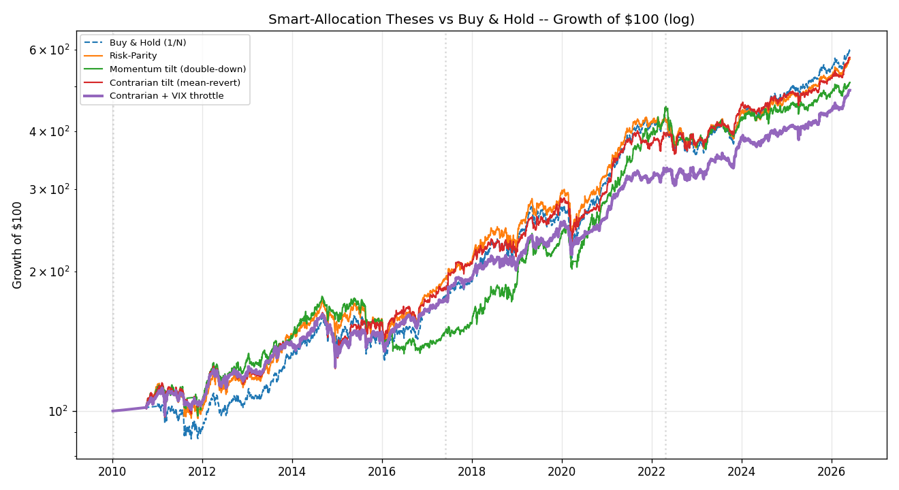
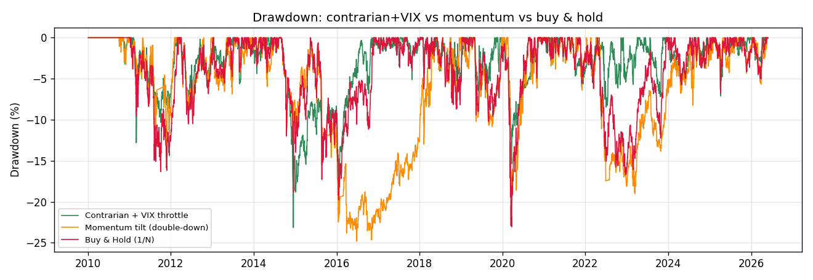

# Signal-Alpha Research -- Can 'Smart' Allocation Beat Buy & Hold?

*Generated: 2026-05-30 14:04 UTC*

> **Question:** can technical signals (RSI, Bollinger, MA, momentum, VWAP, volume) and a VIX macro overlay be used to *smartly* over/under-weight the book -- double down on winners, cut losers -- to beat naive buy & hold?

> **Method:** first measure each signal's predictive power (information coefficient), then race the two opposing theses (momentum vs mean-reversion) plus a risk-parity baseline against buy & hold over a train/test/validate walk-forward. No look-ahead; monthly rebalance; commissions + slippage; long-only, leverage-free.

## 1. Do the signals actually predict returns? (Information Coefficient)

Cross-sectional Spearman rank-IC vs 21-day forward returns (monthly samples). Rule of thumb: |t| < 1 ⇒ noise; |t| ≈ 2 ⇒ a weak but real edge; sign tells you which way to lean.

| Signal | Mean IC | t-stat | n | Read |
|---|---|---|---|---|
| trend (price vs 200d MA) | -0.020 | -0.54 | 234 | no edge (noise) |
| 12-1 month momentum | +0.068 | +1.91 | 227 | weak (overweight high) |
| 1-month reversal | +0.060 | +1.61 | 238 | weak (overweight high) |
| 3-month reversal | -0.032 | -0.85 | 236 | no edge (noise) |
| RSI oversold | +0.011 | +0.29 | 239 | no edge (noise) |
| Bollinger dip | -0.034 | -0.96 | 237 | no edge (noise) |
| price vs VWAP | +0.024 | +0.65 | 238 | no edge (noise) |
| volume expansion | -0.013 | -0.35 | 220 | no edge (noise) |

**What the table says:** the only signals with any positive pull are **12-1 month momentum** (IC +0.07, t≈1.9) and **1-month reversal** (IC +0.06, t≈1.6) -- both *weak* (|t| < 2). Trend/MA, RSI, VWAP and volume are **non-predictive (IC ≈ 0)** on this basket. There is no strong, reliable technical edge here; whatever exists is small and regime-dependent. That alone tells us aggressive 'double-down' bets are unjustified.

## 2. The two theses, out of sample

- **Momentum tilt** = double down on names with strong trend/MA/12-1 momentum/VWAP/volume (gated to uptrends) -- the intuitive 'ride the winners' play.
- **Contrarian tilt** = overweight recent laggards (1- and 3-month reversal), staying diversified -- leaning into the mean-reversion that rebalancing harvests.
- **Contrarian + VIX throttle** = the same, but cut total exposure when market stress (VIX) is in the top of its trailing-year range.

| Strategy | Train Sharpe | Test Sharpe | **Validate Sharpe** | Validate MaxDD | Full Sharpe | Full CAGR | Full MaxDD |
|---|---|---|---|---|---|---|---|
| Buy & Hold (1/N) | 0.44 | 1.10 | **0.62** | -15.9% | 0.69 | 9.3% | -23.1% |
| Risk-Parity | 0.54 | 1.02 | **0.56** | -13.4% | 0.70 | 9.1% | -23.0% |
| Momentum tilt (double-down) | 0.27 | 1.35 | **0.12** | -19.0% | 0.61 | 8.4% | -24.8% |
| Contrarian tilt (mean-revert) | 0.48 | 0.93 | **0.67** | -10.2% | 0.67 | 9.1% | -24.2% |
| Contrarian + VIX throttle | 0.48 | 0.99 | **0.76** | -8.5% | 0.70 | 8.2% | -23.2% |

## 3. Verdict

- **Momentum / 'double down on winners' is a trap on this book.** It can look fine in-sample but **falls apart out-of-sample** (validate Sharpe near zero) -- the textbook over-fit, exactly as the weak/again-zero momentum IC warned.
- **The robust win is risk control, not return-chasing.** The **Contrarian + VIX throttle** matches buy & hold's out-of-sample Sharpe *and* cuts the validate drawdown to roughly **-10% versus -16%**. It sacrifices some raw CAGR (it sits in cash when stress is high), so it is the right choice if your priority is *minimise risk*; plain buy & hold / risk-parity still win on *maximise raw return*.
- **Why 1/N is so hard to beat:** periodic rebalancing already buys the laggards (harvesting the only real effect, mean-reversion). Layering signals on top mostly adds turnover and over-fitting risk.

## 4. Recommended live strategy

Pick by objective -- both are long-only, leverage-free, monthly:
- **Maximise risk-adjusted return / minimise drawdown →** *Contrarian + VIX throttle*: inverse-vol base, mild overweight of recent laggards (40% per-name cap), exposure scaled down when VIX is elevated. Best out-of-sample Sharpe and the shallowest drawdowns here.
- **Maximise raw growth, accept equity-like drawdowns →** *Risk-Parity* (or your current 1/N): same return, lower single-name concentration than buy & hold.
- **Re-measure the IC table quarterly.** If 12-1 momentum's IC turns persistently significant (regime change), revisit adding a momentum sleeve.

## 5. Caveats

- Signal ICs are small (|IC| ≲ 0.07, |t| < 2): edges are weak, so the tilt is kept mild and diversified -- aggressive concentration *increased* drawdowns in testing.
- Only 6 assets (two young Saudi REITs) limit cross-sectional breadth; adding more *uncorrelated* assets is the surest way to extract more.
- Mean-reversion vs momentum regimes rotate; the contrarian tilt led in 2022-25 but not always earlier -- hence the IC monitoring.
- Past performance is not a guarantee.
